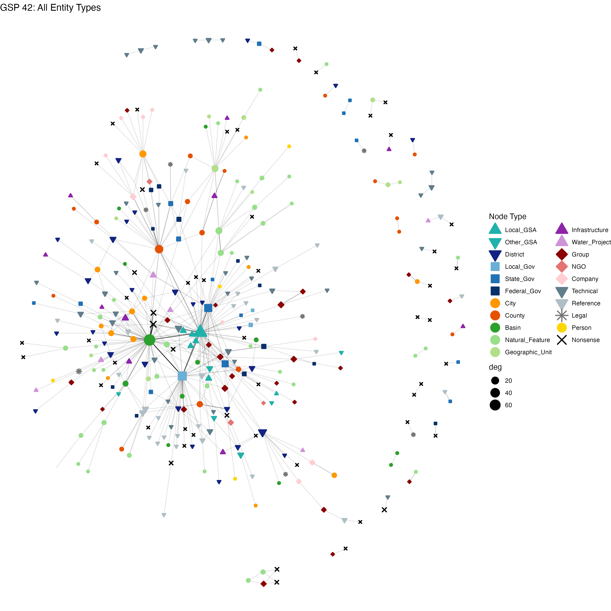
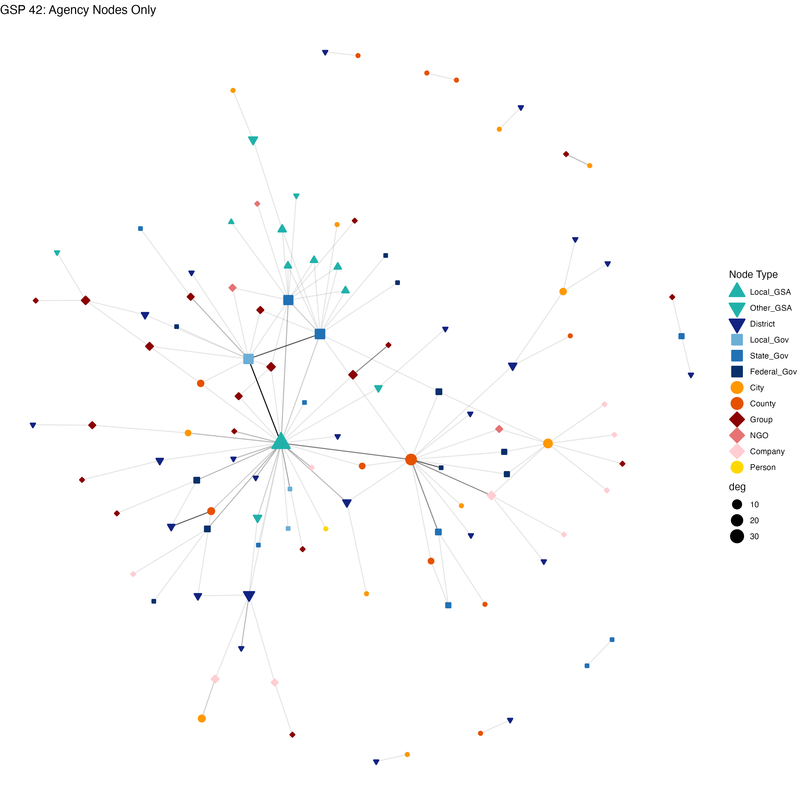

<style>
.reveal .slides {
  font-size: 24px;
}
</style>

## Two Methodological Decisions

We face two decisions about how to construct the governance networks:

1. **Which nodes to include?** All extracted entities (rivers, basins, legal refs, technical docs, ...) or only **social actors** with political agency?
2. **What to do with isolates?** Keep nodes with zero edges (inflating sample with uninformative observations) or **drop them**?

These two decisions matter. They change the story the data tells.

## Why Filter to Agency Nodes?

- NLP extraction treats *"Fresno mentions the Kings River"* and *"Fresno collaborates with Tulare County"* identically --- both create edges
- Only the latter reflects **political influence**, the core construct for EJ hypotheses
- Non-agency entities (rivers, basins, legal codes, technical plans) create structural noise: inflated degree counts, artificial shortest paths through ecological intermediaries
- **Agency filtering** restricts networks to entities capable of exercising political or organizational agency

## Agency Node Types {.scrollable}

```{r agency_types, echo=FALSE}
library(knitr)
library(kableExtra)
library(tibble)

types <- tibble::tribble(
  ~"Kept (Agency)", ~"Removed (Non-Agency)",
  "Local_GSA",      "Basin",
  "Other_GSA",      "Natural_Feature",
  "District",       "Infrastructure",
  "Local_Gov",      "Technical",
  "State_Gov",      "Water_Project",
  "Federal_Gov",    "Reference",
  "City",           "Geographic_Unit",
  "County",         "Legal",
  "Group",          "Data_System",
  "NGO",            "Nonsense",
  "Company",        "",
  "Person",         ""
)

kable(types, align = "c", format = "html") %>%
  kable_styling(full_width = FALSE, bootstrap_options = c("striped", "hover", "condensed"))
```

## Why Drop Isolates?

- After filtering to agency nodes, some places lose all their edges (their only connections were to rivers, basins, or technical documents)
- These **isolates** contribute zero information about social influence --- they have degree 0 across all measures
- Including them in Poisson models inflates the sample with uninformative zero counts, biasing coefficients toward the zero-degree places
- Dropping isolates focuses the analysis on places that are **actually participating** in the governance network
- Sample size: 559--560 (with isolates) $\rightarrow$ **332** (agency, no isolates)

## Example Network: Before & After

:::: {.columns}

::: {.column width="50%"}
{width=100%}
:::

::: {.column width="50%"}
{width=100%}
:::

::::

::: {.notes}
Note the removal of green (natural features/basins), grey (technical/reference), and purple (infrastructure/water projects) nodes.
The remaining network represents the social actor relationships embedded in the GSP text.
:::


## Degree vs In-degree/Out-degree (Tagged Network)

Using the **unfiltered tagged network** (all entities, N=560), comparing centrality measures:

```{r degree_comparison, echo=FALSE}
deg_compare <- tibble::tribble(
  ~"Measure",     ~"DAC Coefficient", ~"Std. Error", ~"Significance",
  "In-degree",    "-0.174",           "(0.052)",     "***",
  "Out-degree",   "-0.318",           "(0.063)",     "***",
  "Total degree", "-0.231",           "(0.040)",     "***"
)

kable(deg_compare, align = c("l", "c", "c", "c"), format = "html",
      caption = "DAC coefficients from Poisson GLM (tagged network, N=560)") %>%
  kable_styling(full_width = FALSE, bootstrap_options = c("striped", "hover", "condensed"))
```

- Everything is significant in the unfiltered network --- but is this real?
- **Out-degree** (exercising influence) shows the strongest DAC penalty (-0.318)
- **In-degree** (receiving influence) shows a weaker penalty (-0.174)
- Are both capturing genuine social dynamics, or is in-degree inflated by non-agency edges?

## Unfiltered vs Agency-Filtered: Full Comparison {.scrollable}

```{r mode_comparison, echo=FALSE}
results <- tibble::tribble(
  ~"Hypothesis",     ~"Original (N≈559)",  ~"Tagged (N=560)",   ~"Agency (N=332)",
  "In-degree",       "-0.170***",          "-0.174***",         "0.019 (NS)",
  "Out-degree",      "-0.312***",          "-0.318***",         "-0.281***",
  "Total degree",    "---",                "-0.231***",         "-0.109**",
  "Leader distance", "0.081**",            "0.102***",          "-0.117**"
)

kable(results, align = c("l", "c", "c", "c"), format = "html",
      caption = "DAC coefficients across network modes (Poisson GLM)") %>%
  kable_styling(full_width = FALSE, bootstrap_options = c("striped", "hover", "condensed")) %>%
  column_spec(4, bold = TRUE)
```

::: {.fragment}
Note: Original mode still includes isolates; Tagged and Agency modes drop isolates.
:::

## What the Agency Filter Reveals

**Out-degree is the robust finding** ($\beta$ = -0.281***):

- DAC places exercise less outgoing influence on other social actors
- This survives both entity filtering and isolate removal
- The effect is substantively large and consistent across all three network specifications

**In-degree was an artifact** ($\beta$ = 0.019, NS):

- The original in-degree signal (-0.174***) was driven by edges to/from non-agency entities
- DAC places were mentioned alongside rivers, basins, and technical documents --- not receiving less social influence

## Leader Distance: A Reversal

The most striking change is in leader distance:

| | Unfiltered | Agency-filtered |
|---|---|---|
| DAC | **+0.102\*\*\*** (farther) | **-0.117\*\*** (closer) |

- In the unfiltered network, DAC places appeared farther from GSA leadership --- but shortest paths ran through non-agency intermediaries (basins, technical docs)
- In the agency-only network, DAC places are actually **closer** to GSA nodes
- This suggests GSAs may specifically engage DAC places through direct social connections, even as those places exercise less outgoing influence

## H0: Place Existence in the Network

```{r h0_comparison, echo=FALSE}
h0_results <- tibble::tribble(
  ~"Version",  ~"Question",                                    ~"DAC Coeff",  ~"Sig",    ~"N",
  "H0a",       "Does place appear in the unmodified network?", "0.196",       "NS",      "829",
  "H0b",       "Does place appear in the agency network?",     "0.172",       "NS",      "829"
)

kable(h0_results, align = c("l", "l", "c", "c", "c"), format = "html",
      caption = "H0: Binomial GLM (exists ~ DAC + incorporated + POP_log + per_latino)") %>%
  kable_styling(full_width = FALSE, bootstrap_options = c("striped", "hover", "condensed"))
```

- Neither version finds DAC status predicts plan appearance
- **Incorporation** is the dominant predictor in both (1.519*** and 1.967***)
- The agency network shows a stronger incorporation effect --- unincorporated places are even less likely to have social actor connections

## The Case for Agency + No Isolates

This specification is preferable on both **theoretical** and **empirical** grounds:

**Theoretical:**

- Our hypotheses are about political influence among social actors, not textual co-occurrence with geographic features
- Isolates with zero social connections are not informative about the degree of influence a place exercises

**Empirical:**

- Reveals that the DAC disadvantage is specifically in **exercising** influence (out-degree), not receiving it
- Uncovers the leader distance reversal --- a finding invisible in the noisy unfiltered network
- The out-degree result is more robust: it survives the most conservative network specification

## Summary

```{r summary_table, echo=FALSE}
summary_tbl <- tibble::tribble(
  ~"Hypothesis",     ~"Unfiltered",            ~"Agency (preferred)",
  "H0: Existence",   "NS",                     "NS",
  "H1: In-degree",   "Significant (artifact)", "NS --- driven by non-agency edges",
  "H2: Out-degree",  "Significant",            "Significant --- robust finding",
  "H3: Degree",      "Significant",            "Weakly significant (p<0.05)",
  "H4: Leader dist", "DAC farther (+)",         "DAC closer (-) --- reversal"
)

kable(summary_tbl, align = c("l", "c", "c"), format = "html") %>%
  kable_styling(full_width = FALSE, bootstrap_options = c("striped", "hover", "condensed")) %>%
  column_spec(3, bold = TRUE)
```

**Bottom line:** DAC communities are not absent from governance networks, but they exercise significantly less outgoing influence on other social actors. The in-degree and leader distance results from the unfiltered network were artifacts of non-agency noise.
