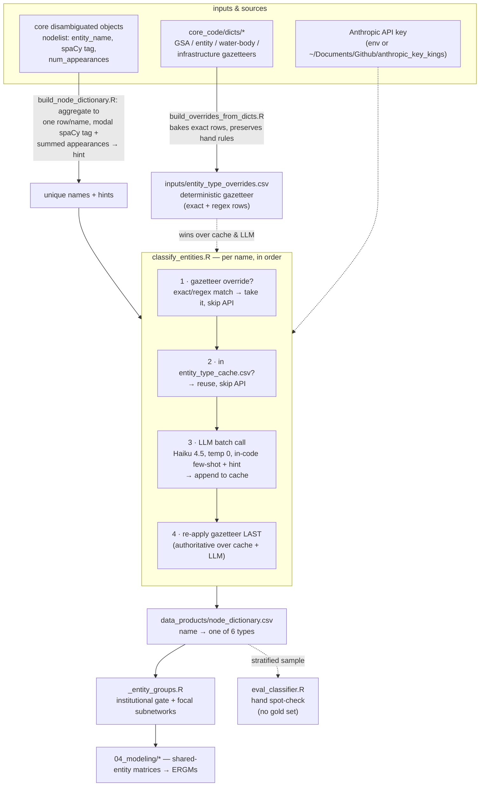

# Entity tagging

How raw entity **names** extracted by the core NER pipeline become the semantic
**entity types** the modeling scripts group on. This is the subsystem that turns
spaCy's noisy `ORG`/`GPE`/`PERSON`/… tags into the six-leaf controlled vocabulary
the paper actually reasons with.

> The main [`README.md`](../../README.md) documents the whole paper pipeline; this
> file zooms in on the `node_dictionary.csv` step (`build_node_dictionary.R`). Its
> one-line "22 semantic types" description there is legacy wording — the live
> vocabulary is the **six** leaves below.

## The vocabulary: six leaves on two axes

Every unique entity name gets exactly one of:

```
                              is it an institutional ACTOR?
                          ┌─────────────── yes ───────────────┐   no
                          │                                   │    │
              ┌───────────┴───────────┐              generic  │    │
        focal institutional leaves    │              residual │    │
   ┌──────────┬──────────┬──────────┐ │                       │    │
  GSA     Consultant   Research    NGO │              Institutional_other   Non_institutional
```

- **Noise gate** (the primary axis): *institutional* (the first five leaves) vs
  **`Non_institutional`** — the reject bucket for persons, basins, natural
  features, non-city/county regions, infrastructure, projects, data systems/
  models, legal/reference/technical strings, journals, and OCR junk.
- **Within institutional:** the three **focal** org types the subnetworks are
  built on (**`Consultant`**, **`Research`**, **`NGO`**), plus **`GSA`**, plus
  **`Institutional_other`** — the generic residual (cities, counties, districts,
  state/federal/local government bodies, non-consulting companies, stakeholder
  committees).

The vocabulary and the per-leaf decision rules (including the negative
boundaries for the pairs that historically leaked — Consultant vs company,
Research vs NGO) live in `classify_entities.R` (`ENTITY_TYPES`, `.type_guidance`).
The groupings built on top of it (`institutional`, the focal subnetworks, the
pooled `consultant_research_ngo`) live in `_entity_groups.R`.

## How the pieces fit together



## The classifier's three-layer decision (per name)

Order matters — this is the resolution precedence inside `classify_entities()`:

1. **Deterministic gazetteer** (`inputs/entity_type_overrides.csv`) — the
   *authoritative* layer. It wins over both the cache and the LLM, and it's
   applied **twice**: up front to exclude matched names from the API to-do set,
   and again at the very end so its verdict overrides everything. It exists
   because the fine distinctions this paper cares about are **identity facts, not
   string facts** — nothing in `luhdorff_and_scalmanini` or `pacific_institute`
   tells a classifier what *kind* of org it is; the GSP world has a small,
   enumerable cast, so a lookup beats guessing. Two match kinds:
   - `exact` — `name == pattern`. Safe for short or place-colliding tokens.
   - `regex` — `grepl(pattern, name)`. Used for distinctive multi-word roots, so
     one rule catches every variant/fragment (`luhdorff` matches
     `scalmanini_eddy_teasdale`, `grace_su_luhdorff`,
     `luhdorff_scalmanini_consulting_engineers_team_11`).

   Regex rows apply in file order (first match wins); exact rows then apply on
   top. **Never persisted to the cache**, so editing the CSV takes effect on the
   next run with no cache bust.

2. **Cache** (`data_products/entity_type_cache.csv`) — every `name → type` the
   LLM has ever returned. Only unseen, un-overridden names hit the API; delete
   the cache to force a full re-classification.

3. **LLM** (`classify_entities.R`) — Claude Haiku 4.5, `temperature = 0`,
   index-keyed JSON batches of 60. The system prompt carries the six-leaf
   decision rules, a small set of **curated in-code few-shot exemplars**
   (`.FEWSHOT_EXAMPLES` — one group per leaf, maintained by hand, not sampled from
   any label file), and each name is passed with a `(spaCy=<tag>, n=<freq>)` hint
   used as a *noisy prior only*. Parse failures / off-vocabulary answers default to
   `Non_institutional`.

## Where the gazetteer comes from

`build_overrides_from_dicts.R` bakes the core NER dictionaries
(`core_code/dicts/*`) into `entity_type_overrides.csv` as `exact` rows —
GSAs → `GSA`; NGOs → `NGO`; districts/tribes/state·federal·regional agencies →
`Institutional_other`; IRWM regions/programs and all water bodies + infrastructure
→ `Non_institutional`. It is **idempotent and additive**: hand-curated rows (the
Consultant/Research/NGO substring regexes) are preserved, auto rows are tagged
`notes=gaz:<dict>` and fully regenerated each run, and an auto row is dropped if
it would clash with a hand rule of a different type. Re-run after editing any
dictionary:

```sh
Rscript Network_Innovation_Paper/Code/01_entity_classification/build_overrides_from_dicts.R
```

## Files

| File | Role |
|---|---|
| `classify_entities.R` | The classifier: vocabulary, prompt, gazetteer + cache + LLM resolution. Public entry `classify_entities(names, hints)`. |
| `build_node_dictionary.R` | Collects the unique entity names from the core disambig objects, calls the classifier, writes `data_products/node_dictionary.csv`. The only place the tagger runs in the pipeline (Stage 1b). |
| `build_gsa_edges.R` | Folds the core weighted graphs down to the `GSA`-typed entities (from `node_dictionary.csv`) → `data_products/all_gsa_edges.csv` (Stage 1c). |
| `build_overrides_from_dicts.R` | Bakes `core_code/dicts/*` into `inputs/entity_type_overrides.csv` (preserving hand rules). |
| `eval_classifier.R` | Hand spot-check: draws a stratified sample of the shipped `node_dictionary.csv` labels (up to N per predicted leaf) for a human to eyeball. **No gold set, no agreement score** — writes `data_products/eval/spotcheck_*.csv` with an empty `looks_wrong` column. |
| `_entity_groups.R` | Downstream groupings the six leaves feed (institutional gate, focal subnetworks). Consumed by `04_modeling/*`. |
| `inputs/entity_type_overrides.csv` | The deterministic gazetteer (exact + regex) — the only authoritative label source. |
| `data_products/node_dictionary.csv` | The output: every unique name → one of the six types. |
| `data_products/entity_type_cache.csv` | Name→type cache; delete to re-classify. |

## Running it

```sh
# Refresh the gazetteer after editing a core dictionary (run FIRST)
Rscript Network_Innovation_Paper/Code/01_entity_classification/build_overrides_from_dicts.R

# Classify any new names, writes node_dictionary.csv
CLOBBER=TRUE Rscript Network_Innovation_Paper/Code/01_entity_classification/build_node_dictionary.R

# Spot-check the shipped labels by hand (stratified sample, no gold set)
NIP_EVAL_PER_CAT=40 Rscript Network_Innovation_Paper/Code/01_entity_classification/eval_classifier.R
```

Needs an Anthropic API key: env `ANTHROPIC_API_KEY`, or the file the classifier
points at (`~/Documents/Github/anthropic_key_kings`). Override the model with
`NIP_CLASSIFIER_MODEL` (e.g. `claude-sonnet-5`) to spend more on the ambiguous
label distinctions.

## Caveats worth knowing

- **spaCy tags are a noisy prior, not a gate.** spaCy over-tags — it labels many
  basins, features, projects, headings, and fragments as `ORG`/`GPE`, and real
  actors can surface as `PERSON` (consultant surnames), `NORP` (tribes), `LAW`,
  `FAC`, or `EVENT`. The hint helps the model; it is never treated as truth in
  either direction.
- **There is no trusted gold label set.** Quality is checked by hand (`eval_classifier.R` samples the shipped labels) and anchored by the deterministic gazetteer, which pins the known cast as identity fact. Few-shot examples are curated in code (`.FEWSHOT_EXAMPLES`), not derived from
  any prior labels.
- **`Non_institutional` is the reject bucket, by design.** Anything the gate
  excludes lands here; the downstream `institutional` grouping is simply "every
  leaf except this one."
```
