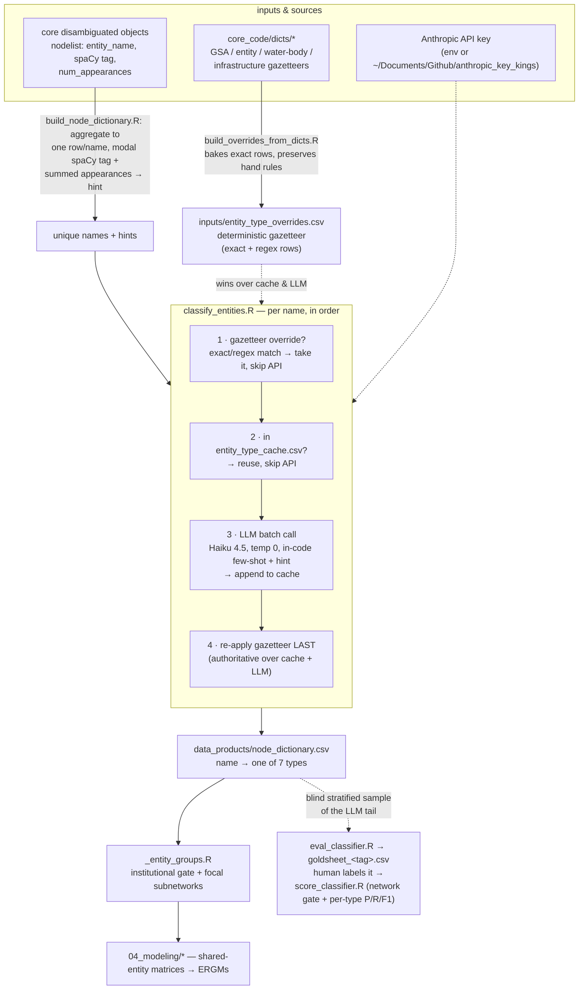

# Entity tagging

How raw entity **names** from the core NER pipeline become the **entity types**
the modeling scripts group on. This subsystem turns spaCy's noisy
`ORG`/`GPE`/`PERSON`/… tags into the seven-category vocabulary the paper uses.

> The main [`README.md`](../../README.md) documents the whole paper pipeline; this
> file zooms in on the `node_dictionary.csv` step (`build_node_dictionary.R`). Its
> one-line "22 semantic types" description there is out of date — the live
> vocabulary is the **seven** categories below.

## The vocabulary: seven categories

Every name gets exactly one. The first question is whether it's an institution at
all; if it is, which kind:

```
  is it an institution?
        │
   ┌────┴─────────────────────────────────────────────┐
  yes                                                  no
   │                                                    │
   ├─ a specific, identifiable one:                Non_institutional
   │    GSA · Consultant · Research · NGO           (people, basins, features,
   │    · Institutional_other                        infrastructure, projects,
   │                                                  models, citations, OCR junk)
   └─ too vague to say which one:
        Institutional_unresolved
```

- **Is it an institution at all?** If not, it's **`Non_institutional`** — people,
  basins, natural features, non-city/county regions, infrastructure, projects,
  data systems/models, laws/citations, journals, and OCR junk.
- **The org types the paper studies:** **`Consultant`**, **`Research`**, **`NGO`**,
  and **`GSA`**.
- **`Institutional_other`:** any *other* specific institution — a named city,
  county, district, government body, non-consulting company, or committee.
- **`Institutional_unresolved`** (added v4, 2026-09-11): clearly an institution, but
  named too vaguely to say *which* one — bare `university`, `the_district`,
  `a_consultant`, `local_agencies`, `the_county` (no place named). The test is
  whether the name tells you *which* actor it is. It counts as an institution (not
  junk), but because you can't tell which one, two plans that both mention it aren't
  really connected — so it is **kept out of every network** (excluded from all
  groupings in `_entity_groups.R`), while still being labeled so vague mentions are
  counted apart from junk. It exists so the model no longer has to choose between
  wrongly dropping a real institution and wrongly inventing a specific one. The one
  new thing it can get wrong: **specific vs. too-vague**.

The vocabulary and the per-category decision rules (including how to tell apart the
pairs that used to get confused — Consultant vs company,
Research vs NGO) live in `classify_entities.R` (`ENTITY_TYPES`, `.type_guidance`).
The groupings built on top of it (`institutional`, the focal subnetworks, the
pooled `consultant_research_ngo`) live in `_entity_groups.R`.

## How the pieces fit together



## The classifier's three-layer decision (per name)

Order matters — this is the resolution precedence inside `classify_entities()`:

1. **Deterministic gazetteer** (`inputs/entity_type_overrides.csv`) — the
   *authoritative* layer. It wins over both the cache and the LLM, and it's
   applied **twice**: up front to exclude matched names from the API to-do set,
   and again at the very end so its verdict overrides everything. It exists
   because the fine distinctions this paper cares about are **identity facts, not
   string facts** — nothing in `luhdorff_and_scalmanini` or `pacific_institute`
   tells a classifier what *kind* of org it is; the GSP world has a small,
   enumerable cast, so a lookup beats guessing. Two match kinds:
   - `exact` — `name == pattern`. Safe for short or place-colliding tokens.
   - `regex` — `grepl(pattern, name)`. Used for distinctive multi-word roots, so
     one rule catches every variant/fragment (`luhdorff` matches
     `scalmanini_eddy_teasdale`, `grace_su_luhdorff`,
     `luhdorff_scalmanini_consulting_engineers_team_11`).

   Regex rows apply in file order (first match wins); exact rows then apply on
   top. **Never persisted to the cache**, so editing the CSV takes effect on the
   next run with no cache bust.

2. **Cache** (`data_products/entity_type_cache.csv`) — every `name → type` the
   LLM has ever returned. Only unseen, un-overridden names hit the API; delete
   the cache to force a full re-classification.

3. **LLM** (`classify_entities.R`) — Claude Haiku 4.5, `temperature = 0`,
   index-keyed JSON batches of 60. The system prompt carries the seven-category
   decision rules and a small set of **hand-written examples in code**
   (`.FEWSHOT_EXAMPLES` — one group per category, maintained by hand, not sampled
   from any label file), and each name is passed with a `(spaCy=<tag>, n=<freq>)`
   hint used as a *rough prior only*. Parse failures / off-vocabulary answers
   default to `Non_institutional`.

## Where the gazetteer comes from

`build_overrides_from_dicts.R` bakes the core NER dictionaries
(`core_code/dicts/*`) into `entity_type_overrides.csv` as `exact` rows —
GSAs → `GSA`; NGOs → `NGO`; districts/tribes/state·federal·regional agencies →
`Institutional_other`; IRWM regions/programs and all water bodies + infrastructure
→ `Non_institutional`. It is **idempotent and additive**: hand-curated rows (the
Consultant/Research/NGO substring regexes) are preserved, auto rows are tagged
`notes=gaz:<dict>` and fully regenerated each run, and an auto row is dropped if
it would clash with a hand rule of a different type. Re-run after editing any
dictionary:

```sh
Rscript Network_Innovation_Paper/Code/01_entity_classification/build_overrides_from_dicts.R
```

## Files

| File | Role |
|---|---|
| `classify_entities.R` | The classifier: vocabulary, prompt, gazetteer + cache + LLM resolution. Public entry `classify_entities(names, hints)`. |
| `build_node_dictionary.R` | Collects the unique entity names from the core disambig objects, calls the classifier, writes `data_products/node_dictionary.csv`. The only place the tagger runs in the pipeline (Stage 1b). |
| `build_gsa_edges.R` | Folds the core weighted graphs down to the `GSA`-typed entities (from `node_dictionary.csv`) → `data_products/all_gsa_edges.csv` (Stage 1c). |
| `build_overrides_from_dicts.R` | Bakes `core_code/dicts/*` into `inputs/entity_type_overrides.csv` (preserving hand rules). |
| `eval_classifier.R` | **Gold-sheet generator.** Draws a BLIND sample of only the names the LLM decided (gazetteer-pinned names are correct by assertion, so excluded), oversampling the four org types + high-frequency names, and writes `data_products/eval/goldsheet_<tag>.csv` (name + spaCy + freq, **no prediction shown**) for a human to fill `gold_type` on, plus a hidden `strata_<tag>.csv` key and a cached `entity_frequencies.csv`. |
| `score_classifier.R` | **Scorer.** Reads the filled `goldsheet_<tag>.csv`, rejoins the shipped prediction, and reports the metrics the modeling actually uses — the **network gate** (does a name go into a network) + **per-type** one-vs-rest P/R/F1 with Wilson 95% CIs, each **name-level and mention-weighted**, plus confusion tables for the pairs that get mixed up. Writes `errors_<tag>.csv`, `promote_candidates_<tag>.csv` (high-n institutional misses, ready to append to the gazetteer), and `metrics_<tag>.csv`. |
| `_entity_groups.R` | The groupings the types feed (which names go into a network, the org-type subnetworks). Both `Non_institutional` and `Institutional_unresolved` are excluded from every grouping. Consumed by `04_modeling/*`. |
| `inputs/entity_type_overrides.csv` | The deterministic gazetteer (exact + regex) — the only authoritative label source. |
| `data_products/node_dictionary.csv` | The output: every unique name → one of the seven types. |
| `data_products/entity_type_cache.csv` | Name→type cache; delete to re-classify. |

## Running it

```sh
# Refresh the gazetteer after editing a core dictionary (run FIRST)
Rscript Network_Innovation_Paper/Code/01_entity_classification/build_overrides_from_dicts.R

# Classify any new names, writes node_dictionary.csv
CLOBBER=TRUE Rscript Network_Innovation_Paper/Code/01_entity_classification/build_node_dictionary.R

# Evaluate the LLM tail: 1) generate a blind gold sheet, 2) hand-label
# goldsheet_current.csv, 3) score it
Rscript Network_Innovation_Paper/Code/01_entity_classification/eval_classifier.R
#   ... fill `gold_type` (one of the seven types) for every row, then:
NIP_EVAL_TAG=current Rscript Network_Innovation_Paper/Code/01_entity_classification/score_classifier.R
```

The eval knobs: `NIP_EVAL_TARGET` (sample size, default 400), `NIP_EVAL_TAG`
(names the sheet/outputs, default `current`), `NIP_EVAL_REFRESH_FREQ=TRUE`
(rebuild the frequency cache from disambig), and `NIP_EVAL_PROMOTE_N` (min `n` for
a missed institutional name to land in `promote_candidates_*.csv`, default 6).

Needs an Anthropic API key: env `ANTHROPIC_API_KEY`, or the file the classifier
points at (`~/Documents/Github/anthropic_key_kings`). Override the model with
`NIP_CLASSIFIER_MODEL` (e.g. `claude-sonnet-5`) to spend more on the ambiguous
label distinctions.

## Caveats worth knowing

- **spaCy tags are a noisy prior, not a gate.** spaCy over-tags — it labels many
  basins, features, projects, headings, and fragments as `ORG`/`GPE`, and real
  actors can surface as `PERSON` (consultant surnames), `NORP` (tribes), `LAW`,
  `FAC`, or `EVENT`. The hint helps the model; it is never treated as truth in
  either direction.
- **There is no *pre-existing* trusted gold label set** (the old unvetted "seed"
  was retired). Gold is created on demand: `eval_classifier.R` draws a blind sample
  of the names the LLM decided, a human labels it, and `score_classifier.R` scores
  against it. The classifier is also anchored by the gazetteer, which pins the known
  orgs by name; the in-code examples (`.FEWSHOT_EXAMPLES`) are hand-written, not
  derived from any prior labels.
- **The eval scores the LLM's calls, not the gazetteer's.** Gazetteer-pinned names
  are correct by assertion, so `eval_classifier.R` samples only the names the LLM
  decided. Read the **network-gate** and **per-type** metrics, not the headline
  7-way accuracy — the large easy `Non_institutional` bucket inflates it. Every
  rate is reported name-level (label quality) **and** mention-weighted (network
  impact), because they routinely diverge.
- **Two types stay out of the network, not one.** The `institutional` grouping is
  the four org types + `Institutional_other`; it excludes **both** `Non_institutional`
  (not an institution) **and** `Institutional_unresolved` (an institution too vague
  to identify). So the scorer's network gate puts both on the "no" side — a real
  specific actor mislabeled `Institutional_unresolved` is a miss, and a vague name
  promoted to a specific type is a false alarm. `Institutional_unresolved` is
  **LLM-only**: the gazetteer pins specific named orgs and never produces it.
```
