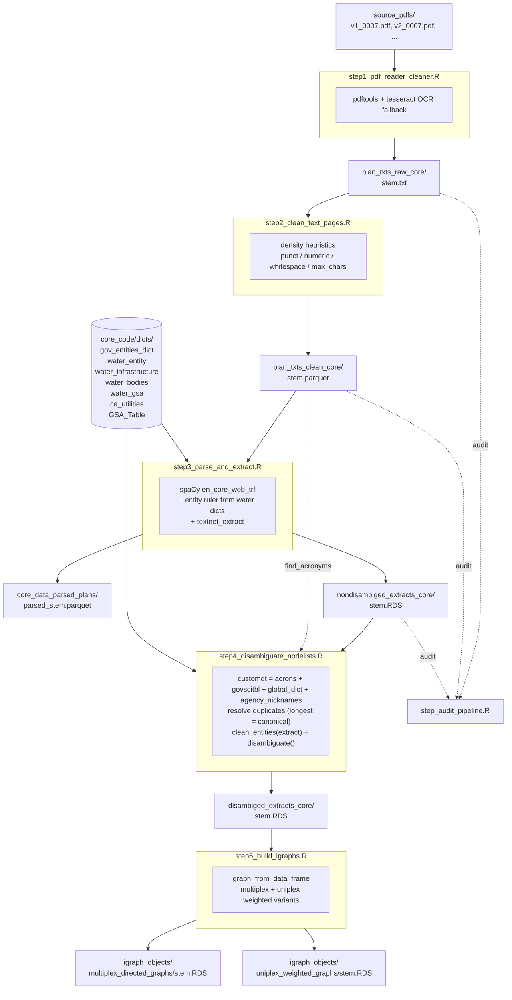

# core_code — Kings GSP Network Pipeline

The core pipeline that turns submitted California Groundwater Sustainability Plans (GSPs) into governance-network graphs. Each numbered step is a standalone R script with a clear input → output contract; intermediate artifacts land in `data/core_data/` and are addressed by the filekey row names in [`../filekey.csv`](../filekey.csv).

## Pipeline diagram



## Step reference

| step | reads | writes | what it does |
|---|---|---|---|
| **step1** `pdf_reader_cleaner` | `source_pdfs/<stem>.pdf` | `plan_txts_raw_core/<stem>.txt` | poppler text extraction; OCR fallback for image-only PDFs. Output is a per-page TSV (`page \t text`). |
| **step2** `clean_text_pages` | `plan_txts_raw_core/<stem>.txt` | `plan_txts_clean_core/<stem>.parquet` | blank out non-prose pages (TOCs, figures, references, oversized maps) via four density thresholds: punct, numeric, whitespace, max characters. Row count preserved so downstream can still align with original PDF pages. |
| **step3** `parse_and_extract` | `plan_txts_clean_core/<stem>.parquet`<br/>+ water_* dictionaries | `core_data_parsed_plans/parsed_<stem>.parquet`<br/>`nondisambiged_extracts_core/<stem>.RDS` | spaCy transformer parse via `textNet::parse_text_trf`. Entity ruler is built from the multi-word terms in the four water dicts (single-token aliases skipped; they're caught in step4). `textnet_extract()` produces a list with `$edgelist` + `$nodelist` data.tables. |
| **step4** `disambiguate_nodelists` | `nondisambiged_extracts_core/<stem>.RDS`<br/>`plan_txts_clean_core/<stem>.parquet` (acronym mining)<br/>`gsa_table_core` (agency_nicknames)<br/>all 6 dictionaries (`gov_entities`, 4× `water_*`, `ca_utilities`) | `disambiged_extracts_core/<stem>.RDS` | builds a per-GSP `customdt` alias→canonical map by stacking 4 sources, resolves duplicate `from` keys ("longest `to` wins"), runs `clean_entities()` over the extract and over every dict source so both sides converge to the same surface form, then `textNet::disambiguate()` rewrites entity names. |
| **step5** `build_igraphs` | `disambiged_extracts_core/<stem>.RDS` | `igraph_objects/multiplex_directed_graphs/<stem>.RDS`<br/>`igraph_objects/uniplex_weighted_graphs/<stem>.RDS` | filters incomplete edges and <2-a-z-letter noise, then `graph_from_data_frame()` produces the multiplex (one edge per SVO triple) and `igraph::simplify(weight="sum")` produces the uniplex weighted variant. |
| **step_audit_pipeline** | step1/2/3 outputs | `pipeline_audit.csv` + console summary | cross-stage retention audit. Reports file-level status, page retention totals, low-yield documents. |

## Stem convention

File stems carry both the plan version and the GSP number:

```
v1_0007.txt   →   plan version 1 (first submission) of GSP 0007
v2_0007.txt   →   plan version 2 (revised submission) of GSP 0007
```

The `v1` / `v2` prefix is the **plan version** — successive submissions of the same physical GSP, with different text content. It is **not** a version of the data-processing pipeline. v1 and v2 of the same GSP are treated as separate cases throughout. The bare zero-padded numeric id (`0007`) is used in step 4 to look up per-GSP metadata (agency table) that is shared across plan versions.

## Dictionaries

Built once, consumed by step 3 (entity ruler) and step 4 (disambiguation map). All live in `core_code/dicts/`:

| dictionary | build script | what it covers |
|---|---|---|
| `gov_entities_dict.csv` | `build_gov_entities_dict.R` | federal + California state + local government agencies; Agency ↔ Abbr pairs (formerly `govscicleaning.R`) |
| `water_entity_dictionary.csv` | `build_water_entity_dictionary.ipynb` | water districts, state agencies, regional boards, tribes, NGOs, IRWM regions |
| `water_infrastructure_dictionary.csv` | `build_water_infrastructure_dictionary.ipynb` | dams, canals, aqueducts, plants, basins (with operator attribution) |
| `water_bodies_dictionary.csv` | `build_water_bodies_dictionary.ipynb` | rivers, lakes, basins, aquifers, watersheds |
| `water_gsa_dictionary.csv` | `build_water_gsa_dictionary.ipynb` | DWR i03 GSAs — live fetch from CNRA open data portal |
| `ca_utilities_dictionary.csv` | `build_ca_utilities_dictionary.ipynb` | California water + electric utilities (IOUs, POUs, JPAs, coops). Live fetch from CEC + CA Waterboards endpoints + hand-curated supplement. |
| `GSA_Table_20230824.RDS` | (snapshot) | per-GSP agency table: GSA name list + `mult_gsas` flag, keyed on GSP number. Snapshot of the legacy `web_repaired_*` series from the STM paper. |

**Dictionary policy.** Each dictionary is comprehensive within its category; no cross-dictionary deduplication at build time. Overlapping aliases across dicts (e.g. LADWP appears in `water_entity` and `ca_utilities` and `gov_entities`) are resolved at runtime in step 4's duplicate-`from` resolution loop. The CSVs themselves are kept in natural format — readable, hand-curatable — and `textNet::clean_entities()` normalizes them when step 4 loads them.

## Running the pipeline

Each step is a top-level R script run from the repo root. Filekey paths are relative to the repo root.

```bash
# From the repo root
Rscript core_code/step1_pdf_reader_cleaner.R
Rscript core_code/step2_clean_text_pages.R
Rscript core_code/step3_parse_and_extract.R
Rscript core_code/step4_disambiguate_nodelists.R
Rscript core_code/step5_build_igraphs.R

# Optional retention audit at any point after step 3
Rscript core_code/step_audit_pipeline.R
```

Each step has a `CLOBBER` (or `overwrite`) flag at the top — default `FALSE` skips files whose output already exists, `TRUE` rebuilds. Step 3 additionally has a `testing` flag that restricts to the first 5 GSPs.

To regenerate a dictionary:

```bash
# R-based build
cd core_code/dicts && Rscript build_gov_entities_dict.R

# Python-notebook builds (no jupyter needed)
cd core_code/dicts && python3 -c "
import json
nb = json.load(open('build_water_gsa_dictionary.ipynb'))
exec('\n'.join(''.join(c['source']) if isinstance(c['source'], list) else c['source']
               for c in nb['cells'] if c['cell_type']=='code'))
"
```

## Filekey contract

All filesystem paths used by the pipeline come from `../filekey.csv`. Each step does:

```r
filekey <- read.csv("filekey.csv")
some_path <- filekey[filekey$var_name == "<some_var>", ]$filepath
```

The core pipeline owns the `*_core` var-name namespace; legacy `*_govnetpaper` and `*_stmpaper` rows in the same file are kept for paper-specific code that lives outside `core_code/`. Don't repoint those rows at core paths — the right move is to add a new `*_core` row and update only the core script that reads it.

## What lives outside core_code

The following deliberately do *not* live in this directory:
- Per-paper analysis scripts (Network_Innovation_Paper, EJ_DAC_Paper, Structural_Topic_Model_Paper, etc.) — they consume core outputs but their analytical choices are paper-specific.
- Downstream graph analysis (ERGMs, centrality, supernetwork construction, plotting). Those used to live alongside step 4–6 but were factored out so core_code is purely the document-to-graph pipeline.
