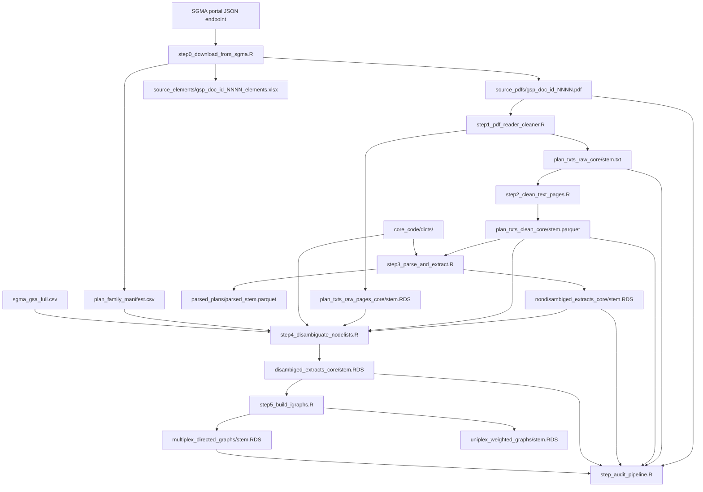

# core_code — Kings GSP Network Pipeline

The core pipeline that turns submitted California Groundwater Sustainability Plans (GSPs) into governance-network graphs. Each numbered step is a standalone R script with a clear input → output contract; intermediate artifacts land in `data/core_data/` and are addressed by the var-name rows in [`../filekey.csv`](../filekey.csv).

## Pipeline diagram



## Step reference

| step | reads | writes | what it does |
|---|---|---|---|
| **step0** `download_from_sgma` | `/portal/service/gsp/submittedgsps` + `/portal/service/gsp/archives` (JSON enumerators); `/portal/gsp/preview/<gspId>` HTML per gspId | `source_pdfs/gsp_doc_id_<NNNN>.pdf`<br/>`source_elements/gsp_doc_id_<NNNN>_elements.xlsx`<br/>`source_pdfs/plan_family_manifest.csv` | unified portal-refresh workflow. Pulls both the active and archived gspId feeds and dedupes; for each gspId scrapes its preview page to find every "Groundwater Sustainability Plan" PDF (rejecting Redline and Elements Guide variants from the plan-PDF list), per-version submission/posted/comment-end dates, the Elements Guide URL, and the GSA list. Writes the per-(gspId, gspDocId) manifest additively — rows the portal de-lists between runs are carried forward with their existing `first_seen` / `last_seen`. Downloads any plan PDF or Elements Guide xlsx not already on disk (30 min timeout, 1 retry per file). `STEP0_SKIP_SCRAPE=1` skips the ~10 min preview-scrape phase and only diffs against disk. `STEP0_TEST_GSP_ID=<id>` dumps one preview page's parsed rows and exits — used to verify the scraper before a full run. |
| **step1** `pdf_reader_cleaner` | `source_pdfs/<stem>.pdf`<br/>`eng_words.rda` | `plan_txts_raw_core/<stem>.txt`<br/>`plan_txts_raw_pages_core/<stem>.RDS` | poppler text extraction with two-tier OCR fallback. **Whole-document OCR** when poppler returns empty pages (scanned PDFs). **Per-page OCR repair** for PDFs with broken ToUnicode CMaps — subsetted CID fonts from macOS Quartz produce constant-shifted glyph-index garbage that displays fine but extracts as nonsense. Each page is scored against `eng_words`; pages below `ENG_RATIO_MIN` (default 0.30) with at least `MIN_ALPHA_TOKENS` (default 20) are re-extracted via `pdf_ocr_text(pdf, pages = chunk)` in batches of `OCR_BATCH_SIZE` (default 50). A batch that errors falls back to per-page OCR. OCR calls run in a `callr` subprocess so a poppler segfault can't take down the script. Writes a per-page TSV (`page\ttext`) plus the raw `pdftools::pdf_text()` output as RDS (one element per page, newlines and multi-space gaps preserved — used by step4's `extract_front_matter_acronyms()` path). |
| **step2** `clean_text_pages` | `plan_txts_raw_core/<stem>.txt` | `plan_txts_clean_core/<stem>.parquet` | blanks out non-prose pages (TOCs, figures, references, oversized maps) via four density thresholds: punct, numeric, whitespace, max characters. Row count preserved so downstream can still align with original PDF pages. |
| **step3** `parse_and_extract` | `plan_txts_clean_core/<stem>.parquet`<br/>all 6 `CORE_DICT_KEYS` dictionaries | `core_data_parsed_plans/parsed_<stem>.parquet`<br/>`nondisambiged_extracts_core/<stem>.RDS` | spaCy transformer parse via `textNet::parse_text_trf` (model: `en_core_web_trf`, Python env via `SPACY_ENV` / `CORE_SPACY_ENV`). Entity ruler is built from the multi-word terms across every CORE dict (single-token aliases skipped here — they're handled in step4). `textNet::textnet_extract()` then produces a list with `$edgelist` + `$nodelist` data.tables. Step3 computes the to-do set up front and only loads parquets / spaCy for GSPs whose extract isn't already on disk. |
| **step4** `disambiguate_nodelists` | `nondisambiged_extracts_core/<stem>.RDS`<br/>`plan_txts_clean_core/<stem>.parquet` (in-text acronyms)<br/>`plan_txts_raw_pages_core/<stem>.RDS` (front-matter acronym tables)<br/>`plan_family_manifest.csv` (per-doc gspId + gsa_ids)<br/>`sgma_gsa_full.csv` (GSA_ID → GSA_Name)<br/>all 6 `CORE_DICT_KEYS` dictionaries | `disambiged_extracts_core/<stem>.RDS` | builds a per-GSP `customdt` alias→canonical map by stacking three sources: (1) per-doc acronyms mined via `textNet::find_intext_acronyms()` on the clean text plus `textNet::extract_front_matter_acronyms()` on the raw pages, (2) the `global_dict` from all 6 CORE dicts (schema-aware: `all_names` pipe-delimited rows from the 5 water/utility dicts; `Agency`/`Abbr` columns from `gov_entities_dict`), (3) the per-GSP `agency_nicknames` — for each docId stem, looks up `gsa_ids` in the manifest, joins to `sgma_gsa_full.csv` for `GSA_Name`, builds the "Agency"/"Agencies" coreference rules for *that specific plan*. Resolves duplicate `from` keys (longest `to` wins), normalizes both extract entity names and dict surfaces through `clean_entities()`, then `textNet::disambiguate()` rewrites entity names in `$edgelist` and `$nodelist`. The pre-disambig name is preserved on each nodelist row as `raw_entity_name`. |
| **step5** `build_igraphs` | `disambiged_extracts_core/<stem>.RDS` | `igraph_objects/multiplex_directed_graphs/<stem>.RDS`<br/>`igraph_objects/uniplex_weighted_graphs/<stem>.RDS` | drops edges with NA in source OR target (igraph rejects either), letter-filter on <2-a-z-letter names, dedups nodelist by canonical entity_name. Every remaining nodelist row becomes a vertex even if it has no surviving edges — they appear in the graph as isolates. `graph_from_data_frame()` produces the multiplex (one edge per SVO triple, all verb attrs preserved); `igraph::simplify(weight="sum")` collapses parallel edges into the uniplex weighted variant (self-loops kept). |
| **step_audit_pipeline** | every stage's output dir | `pipeline_audit.csv` | 8-metric retention audit per GSP. Columns: `pdf_pages` (pdftools::pdf_info page count), `raw_rows` (rows in the raw TSV), `clean_nonblank` (clean parquet rows where text is not blank), `extract_nodes` / `extract_edges` (nondisambig RDS sizes), `disambig_nodes`, `graph_nodes` / `graph_edges` (multiplex), `status` (ok / missing_<stage>). Prints status counts to console. |

## Stem convention

Step0 names every downloaded PDF after its **portal gspDocId** — the per-document identifier that doesn't change once a document is posted. Filename is `gsp_doc_id_<NNNN>.pdf`, and every downstream artifact stem matches that NNNN:

```
source_pdfs/gsp_doc_id_944.pdf            # gspDocId 944 (Aliso WD 2020 plan)
plan_txts_raw_core/944.txt                # step1 stem
plan_txts_clean_core/944.parquet          # step2 stem
parsed_plans/parsed_944.parquet           # step3 parsed parquet
nondisambiged_extracts_core/944.RDS       # step3 extract
disambiged_extracts_core/944.RDS          # step4 extract
multiplex_directed_graphs/944.RDS         # step5 multiplex
uniplex_weighted_graphs/944.RDS           # step5 uniplex
source_elements/gsp_doc_id_944_elements.xlsx
```

A single gspId (preview page identifier) maps to **multiple** gspDocIds when the agency has resubmitted — e.g., Aliso WD's preview page `/portal/gsp/preview/7` holds gspDocIds 944 (2020 submission) and 8770 (2022 resubmission) and 11932 (2026 amendment via separate gspId 174). Each gets its own file.

Plan-family information — which gspDocId belongs to which gspId, which gspId chains back to which canonical (root) gspId via `fromGspId`, version numbers, submission dates, GSA membership — lives in `plan_family_manifest.csv`. Downstream code that needs "which plan family does file X belong to?" reads the manifest.

Legacy filenames `v<N>_gsp_num_id_<NNNN>.pdf` / `v<N>_<NNNN>.<ext>` still parse if they happen to be on disk (step1's regex tolerates the prefix), but the docId convention is what step0 produces going forward. A one-shot cleanup script `migrate_pdf_naming.R` is provided to move pre-docId files into per-directory `_legacy/` subdirs; see [Migration](#migration) below.

## Dictionaries

Built once, consumed by step3 (entity ruler) and step4 (disambiguation map). All live in `core_code/dicts/`:

| dictionary | build script | what it covers |
|---|---|---|
| `gov_entities_dict.csv` | `build_gov_entities_dict.R` | federal + California state + local government agencies; Agency ↔ Abbr columns |
| `water_entity_dictionary.csv` | `build_water_entity_dictionary.ipynb` | water districts, state agencies, regional boards, tribes, NGOs, IRWM regions |
| `water_infrastructure_dictionary.csv` | `build_water_infrastructure_dictionary.ipynb` | dams, canals, aqueducts, plants, basins (with operator attribution) |
| `water_bodies_dictionary.csv` | `build_water_bodies_dictionary.ipynb` | rivers, lakes, basins, aquifers, watersheds |
| `water_gsa_dictionary.csv` | `build_water_gsa_dictionary.ipynb` | DWR i03 GSAs — live fetch from CNRA open data portal |
| `ca_utilities_dictionary.csv` | `build_ca_utilities_dictionary.ipynb` | California water + electric utilities (IOUs, POUs, JPAs, coops). Live fetch from CEC + CA Waterboards endpoints + hand-curated supplement. |

`core_code/dicts/_legacy/` holds historical snapshots that the active pipeline no longer reads (`GSA_Table_20230824.RDS`, etc.).

The five water + utility dicts use the `all_names` pipe-delimited schema (first piece = canonical, rest = aliases); `gov_entities_dict` uses (`State`, `Agency`, `Abbr`) columns. Both `step3::load_dict_terms()` and `step4::load_alias_pairs()` schema-detect at load time. Dicts on disk are space-separated (so step3's entity ruler matches raw PDF text); step4 normalizes spaces and hyphens to underscores at load time so dict aliases align with the spaCy-concatenated entity names in the nodelist.

**GSA metadata** lives separately at `data/core_data/metadata/sgma_gsa_full.csv`, built by `core_code/metadata_generators/scrape_gsa_orgmembers.ipynb` (merges the DWR i03 Open Data CSV with the SGMA Portal print-page Section-C scrape — formation_type, member_entities, etc.). This is the table step4 joins against to turn each docId's `gsa_ids` into per-GSP `agency_nicknames`.

**Dictionary policy.** Each dictionary is comprehensive within its category; no cross-dictionary deduplication at build time. Overlapping aliases across dicts (e.g. LADWP appears in `water_entity` and `ca_utilities` and `gov_entities`) are resolved at runtime in step4's duplicate-`from` collision loop. The CSVs themselves are kept human-readable / hand-curatable; `textNet::clean_entities()` normalizes them when step4 loads.

## Running the pipeline

Each step is a standalone Rscript run from the repo root. Filekey paths are relative to the repo root.

```bash
# Refresh from the portal (writes manifest, downloads new PDFs + elements)
Rscript core_code/step0_download_from_sgma.R

# Document → graph pipeline (depends on PDFs being on disk)
Rscript core_code/step1_pdf_reader_cleaner.R
Rscript core_code/step2_clean_text_pages.R
Rscript core_code/step3_parse_and_extract.R
Rscript core_code/step4_disambiguate_nodelists.R
Rscript core_code/step5_build_igraphs.R

# Retention audit at any point after step 1
Rscript core_code/step_audit_pipeline.R
```

The wrapper `run_pipeline.sh` queues steps in sequence, captures a single timestamped log to `pipeline_run_logs/`, and prepends step0 on demand:

```bash
./core_code/run_pipeline.sh                                # step1..5 + audit
./core_code/run_pipeline.sh --with-step0                   # prepend step0
./core_code/run_pipeline.sh --clobber                      # CLOBBER=TRUE everywhere
./core_code/run_pipeline.sh --testing                      # TESTING=TRUE (first N files)
./core_code/run_pipeline.sh --no-audit                     # skip the audit at the end
./core_code/run_pipeline.sh step4 step5                    # subset, in given order

# Detach so the queue survives logout:
nohup ./core_code/run_pipeline.sh --with-step0 &
```

Steps run sequentially — each must finish before the next starts, so the wrapper is a queue by design. Skip step1 (or any earlier step) by simply listing the steps you do want.

To regenerate a dictionary:

```bash
# R-based build
cd core_code/dicts && Rscript build_gov_entities_dict.R

# Python-notebook builds (no jupyter needed)
cd core_code/dicts && python3 -c "
import json
nb = json.load(open('build_water_gsa_dictionary.ipynb'))
exec('\n'.join(''.join(c['source']) if isinstance(c['source'], list) else c['source']
               for c in nb['cells'] if c['cell_type']=='code'))
"
```

To regenerate the GSA metadata table:

```bash
# Same notebook-runner trick on core_code/metadata_generators/scrape_gsa_orgmembers.ipynb
# Or open in Jupyter and run all cells.
```

## Migration

If you're upgrading from the pre-docId corpus (filenames like `v1_gsp_num_id_0007.pdf`), run the one-shot cleanup:

```bash
# Dry-run first — shows what would be moved
Rscript core_code/migrate_pdf_naming.R

# Apply: moves every legacy *_gsp_num_id_* file plus matching downstream
# artifacts into per-directory _legacy/ subdirs. Files are MOVED, not
# deleted — _legacy/ stays as a recoverable snapshot until you delete it.
MIGRATE_APPLY=1 Rscript core_code/migrate_pdf_naming.R

# Then refresh from the portal under the new convention
Rscript core_code/step0_download_from_sgma.R
```

Once verified, the `_legacy/` directories are safe to delete by hand:

```bash
rm -rf data/core_data/*/_legacy data/core_data/*/*/_legacy
```

The migration script is a one-shot; delete `core_code/migrate_pdf_naming.R` after a clean migration.

## Filekey contract

All filesystem paths used by the pipeline come from `../filekey.csv`. Each step sources `_config.R` at the top, which loads `filekey` once, validates uniqueness, and exposes a tiny lookup helper:

```r
source("core_code/_config.R")        # provides CLOBBER, TESTING, MIN_PAGE_CHARS, fk(), filekey

some_path <- fk("some_var")          # errors if the key is missing
```

The core pipeline owns the `*_core` var-name namespace.

## Shared config (`_config.R`)

Cross-step settings live in `core_code/_config.R` so a single change rolls through the pipeline. Override from the shell:

| Env var               | R variable        | Default | Used by                                              |
|---|---|---|---|
| `CORE_CLOBBER=1`      | `CLOBBER`         | `FALSE` | every step (re-run even if output exists)            |
| `CORE_TESTING=1`      | `TESTING`         | `FALSE` | step2, step3                                         |
| `CORE_TESTING_N=10`   | `TESTING_N`       | `5`     | step2, step3                                         |
| `CORE_MIN_PAGE_CHARS` | `MIN_PAGE_CHARS`  | `200`   | step3 (filter pages before parsing)                  |
| `CORE_PARSE_WORKERS`  | `PARSE_WORKERS`   | `4`     | step3 (cl= passed to textnet_extract)                |
| `CORE_SPACY_ENV`      | `SPACY_ENV`       | `"spacy-env"` | step3 (conda env name or python binary path) |

`run_pipeline.sh --clobber` and `run_pipeline.sh --testing` set the env vars for you. Per-step tunables that no other step needs (step1's `ENG_RATIO_MIN`, step2's density thresholds, step0's `REQUEST_DELAY` and `DOWNLOAD_TIMEOUT`) stay local to their step. Step0 and the migration script have their own env vars (`STEP0_TEST_GSP_ID`, `STEP0_SKIP_SCRAPE`, `MIGRATE_APPLY`) documented in the respective script headers.

## What lives outside core_code

Deliberately not in this directory:

- **Per-paper analysis scripts.** They consume core outputs but their analytical choices are paper-specific. The preferred workflow is to copy the most up-to-date data into a paper-specific data subdirectory and proceed from there — the point is to isolate a static version for paper-specific reproducibility.
- **Downstream graph analysis** (ERGMs, centrality, supernetwork construction, plotting). `core_code` is purely the document-to-graph pipeline.
- **textNet package source.** Lives at a sibling repo (e.g. `/Users/.../GitHub/textnet`) and is `library(textNet)`'d at runtime.
